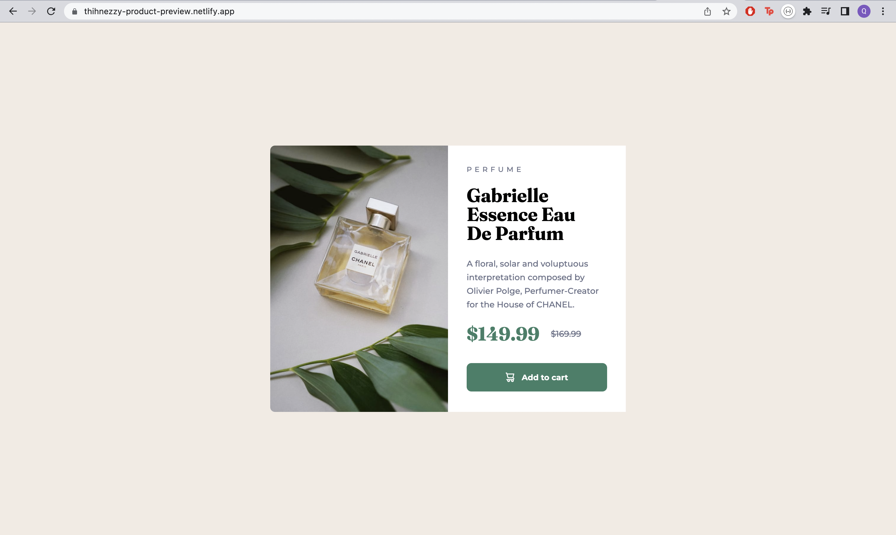

# Frontend Mentor - Product preview card component solution

This is a solution to the [Product preview card component challenge on Frontend Mentor](https://www.frontendmentor.io/challenges/product-preview-card-component-GO7UmttRfa). Frontend Mentor challenges help you improve your coding skills by building realistic projects. 

## Table of contents

- [Overview](#overview)
  - [The challenge](#the-challenge)
  - [Screenshot](#screenshot)
  - [Links](#links)
  - [Built with](#built-with)
  - [What I learned](#what-i-learned)
- [Author](#author)

**Note: Delete this note and update the table of contents based on what sections you keep.**

## Overview

### The challenge

Users should be able to:

- View the optimal layout depending on their device's screen size
- See hover and focus states for interactive elements

### Screenshot

### Links

- Solution URL: [Add solution URL here](https://thihnezzy-product-preview.netlify.app/)
### Built with

- Pure HTML and CSS

**Note: These are just examples. Delete this note and replace the list above with your own choices**

### What I learned

During this small project, I speeded up my HTML markup as well as quickly identified the elements which are in the card style.

## Author

- Frontend Mentor - [@yourusername](https://www.frontendmentor.io/profile/nobody1234455)

